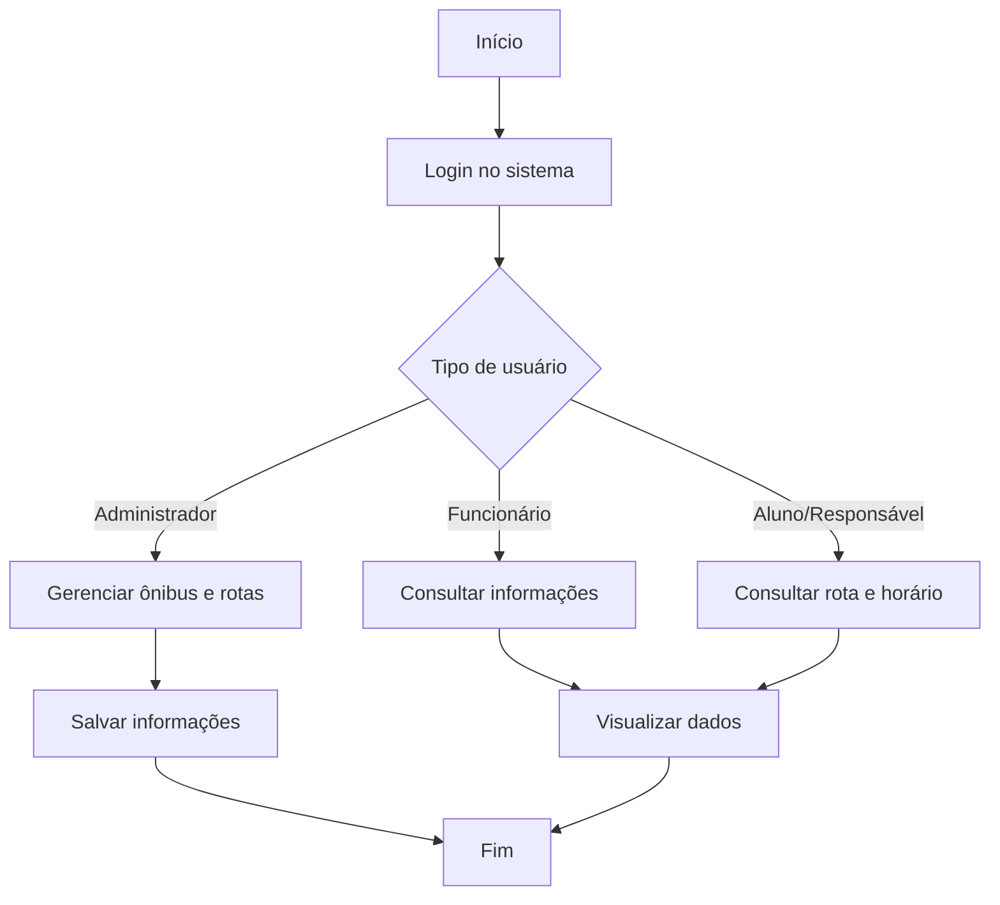
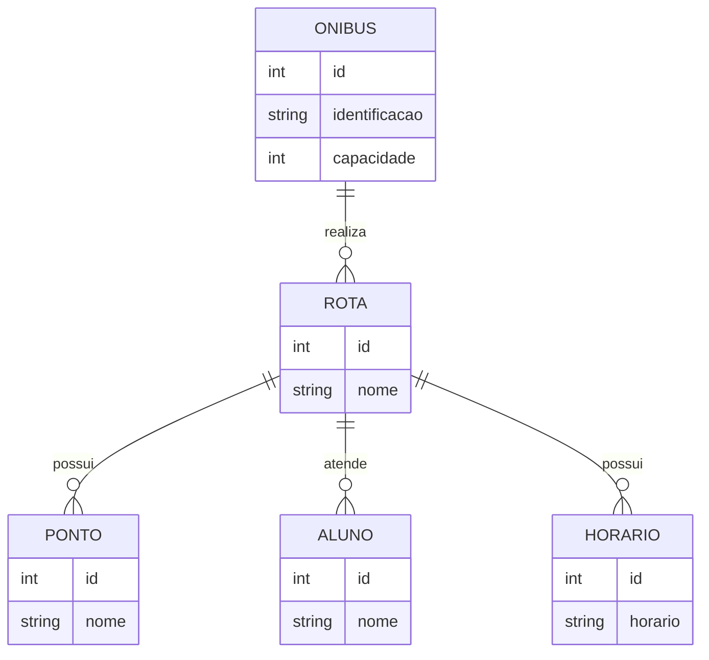

```mermaid
flowchart TD
    A[Início] --> B[Login no sistema]
    B --> C{Tipo de usuário}

    C -->|Administrador| D[Gerenciar ônibus e rotas]
    C -->|Funcionário| E[Consultar informações]
    C -->|Aluno/Responsável| F[Consultar rota e horário]

    D --> G[Salvar informações]
    E --> H[Visualizar dados]
    F --> H

    G --> I[Fim]
    H --> I
```

```mermaid
erDiagram
    ONIBUS ||--o{ ROTA : realiza
    ROTA ||--o{ PONTO : possui
    ROTA ||--o{ ALUNO : atende
    ROTA ||--o{ HORARIO : possui

    ONIBUS {
        int id
        string identificacao
        int capacidade
    }

    ROTA {
        int id
        string nome
    }

    PONTO {
        int id
        string nome
    }

    ALUNO {
        int id
        string nome
    }

    HORARIO {
        int id
        string horario
    }
```

